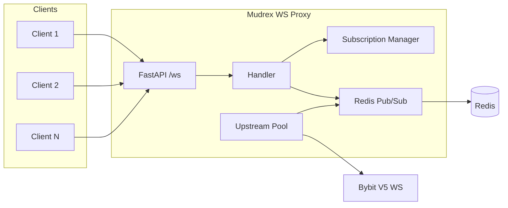
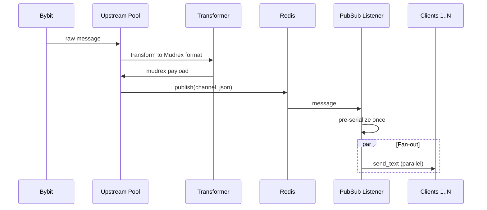
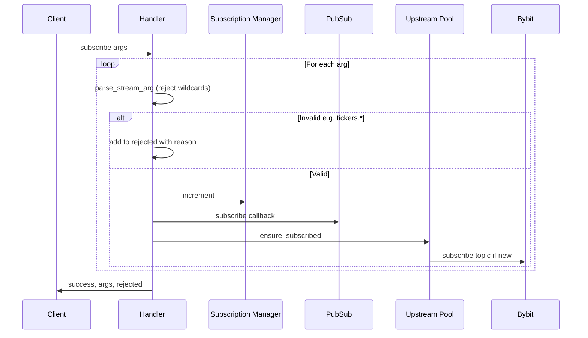
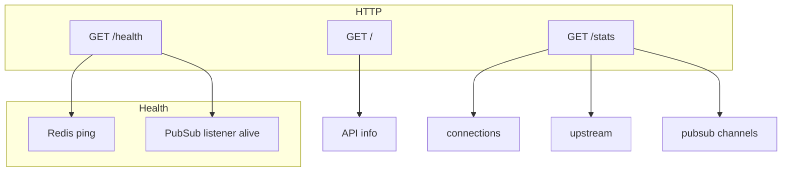
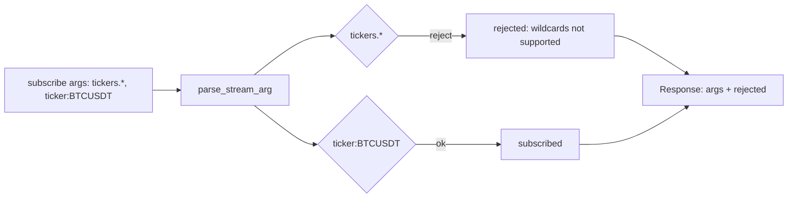

```
  ███╗   ███╗██╗   ██╗██████╗ ██████╗ ███████╗██╗  ██╗
  ████╗ ████║██║   ██║██╔══██╗██╔══██╗██╔════╝╚██╗██╔╝
  ██╔████╔██║██║   ██║██║  ██║██████╔╝█████╗   ╚███╔╝
  ██║╚██╔╝██║██║   ██║██║  ██║██╔══██╗██╔══╝   ██╔██╗
  ██║ ╚═╝ ██║╚██████╔╝██████╔╝██║  ██║███████╗██╔╝ ██╗
  ╚═╝     ╚═╝ ╚═════╝ ╚═════╝ ╚═╝  ╚═╝╚══════╝╚═╝  ╚═╝
  ░  >>  W E B S O C K E T  <<  ░  Real-time stream  ░
  ▓▓▓▓▓▓▓▓▓▓▓▓▓▓▓▓▓▓▓▓▓▓▓▓▓▓▓▓▓▓▓▓▓▓▓▓▓▓▓▓▓▓▓▓▓▓▓▓▓▓▓▓▓▓▓▓▓▓▓▓▓▓▓▓▓▓▓▓▓▓▓▓
  Bybit V5  →  Redis Pub/Sub  →  1000+ clients  |  ticker · kline · trade
  ▓▓▓▓▓▓▓▓▓▓▓▓▓▓▓▓▓▓▓▓▓▓▓▓▓▓▓▓▓▓▓▓▓▓▓▓▓▓▓▓▓▓▓▓▓▓▓▓▓▓▓▓▓▓▓▓▓▓▓▓▓▓▓▓▓▓▓▓▓▓▓▓
```

Production-ready WebSocket proxy that connects to **Bybit V5** and exposes a **Mudrex-branded** real-time futures stream. Built for scale: parallel fan-out, rate limits, graceful shutdown, and human-readable subscription errors.


---

## Overview

- Stream **tickers**, **klines**, and **trades** under the Mudrex brand
- **1000+ concurrent clients** via parallel fan-out and pre-serialized messages
- Single Bybit connection, multiplexed; **reference counting** for symbols
- **Human-readable errors** for invalid subscriptions (e.g. wildcards rejected)
- **Health** includes Redis + PubSub listener; **graceful shutdown** drains clients

---

## Quick Start

### 1. Clone and Configure

```bash
git clone https://github.com/DecentralizedJM/mudrex-proxy-server-websocket.git
cd mudrex-proxy-server-websocket
cp .env.example .env
# Edit .env with your Redis URL
```

### 2. Run Locally

```bash
pip install -r requirements.txt
docker run -d -p 6379:6379 redis:alpine
python -m uvicorn app.main:app --reload
```

### 3. Deploy to Railway

1. Connect the repo to [Railway](https://railway.app)
2. Add a **Redis** service and set `REDIS_URL`
3. Deploy → `wss://your-app.up.railway.app/ws`

---

## Architecture

### High-level flow



### Message path: Bybit → Clients



### Subscribe / Unsubscribe flow



### Health and lifecycle



### Rejected subscription response

When a client sends an invalid arg (e.g. `tickers.*`), the server does not forward it to Bybit and returns a clear reason:



---

## WebSocket API

### Connect

```python
import asyncio
import websockets
import json

async def main():
    async with websockets.connect("wss://your-server.up.railway.app/ws") as ws:
        await ws.send(json.dumps({
            "op": "subscribe",
            "args": ["ticker:BTCUSDT", "ticker:ETHUSDT"]
        }))
        async for message in ws:
            print(json.loads(message))

asyncio.run(main())
```

### Stream formats

| Stream Type | Format | Example |
|-------------|--------|---------|
| Ticker | `ticker:{SYMBOL}` or `tickers.{SYMBOL}` | `ticker:BTCUSDT`, `tickers.ETHUSDT` |
| Kline | `kline:{INTERVAL}:{SYMBOL}` | `kline:1h:BTCUSDT` |
| Trade | `trade:{SYMBOL}` | `trade:BTCUSDT` |

**Wildcards (e.g. `tickers.*`) are not supported** — Bybit requires specific symbols. Invalid args are rejected with a human-readable reason in the response.

### Operations

| Operation | Request | Response |
|-----------|---------|----------|
| Subscribe | `{"op": "subscribe", "args": ["ticker:BTCUSDT"]}` | `{"op": "subscribe", "success": true, "args": [...], "rejected": null}` |
| Subscribe (with invalid) | args include e.g. `tickers.*` | `rejected`: `[{"arg": "tickers.*", "reason": "Wildcards (e.g. tickers.*) are not supported. Use specific symbols like tickers.BTCUSDT or ticker:ETHUSDT."}]` |
| Unsubscribe | `{"op": "unsubscribe", "args": ["ticker:BTCUSDT"]}` | `{"op": "unsubscribe", "success": true, "args": [...]}` |
| Ping | `{"op": "ping"}` | `{"op": "pong", "timestamp": 1234567890}` |

### Data message format

```json
{
    "stream": "mudrex.futures.ticker.BTCUSDT",
    "type": "update",
    "data": {
        "symbol": "BTCUSDT",
        "price": "44578.50",
        "markPrice": "44575.00",
        "high24h": "45000.00",
        "low24h": "43500.00",
        "volume24h": "112000",
        "change24hPercent": "1.44",
        "bid": {"price": "44578.00", "size": "10"},
        "ask": {"price": "44579.00", "size": "5"},
        "fundingRate": "0.0001"
    },
    "timestamp": 1704063600000,
    "source": "mudrex"
}
```

---

## Environment Variables

| Variable | Required | Default | Description |
|----------|----------|---------|-------------|
| `REDIS_URL` | ✅ | - | Redis connection URL |
| `DEBUG` | | `false` | Enable debug logging |
| `ENVIRONMENT` | | `production` | Environment name |
| `REDIS_MAX_CONNECTIONS` | | `50` | Redis pool size; use 50–100 for 1000+ clients |
| `MAX_CLIENTS_TOTAL` | | `10000` | Max connected clients |
| `MAX_SUBSCRIPTIONS_PER_CLIENT` | | `100` | Max subscriptions per client |
| `MAX_MESSAGE_RATE_PER_CLIENT` | | `100` | Max client messages per second (receive-side) |
| `CLIENT_IDLE_TIMEOUT` | | `300` | Idle timeout in seconds |
| `FANOUT_CALLBACK_TIMEOUT` | | `5` | Seconds per client send before skipping slow clients |

---

## HTTP Endpoints

| Endpoint | Description |
|----------|-------------|
| `GET /` | API info |
| `GET /health` | Health check: Redis + PubSub listener status |
| `GET /stats` | Server statistics (connections, upstream, pubsub) |
| `WS /ws` | WebSocket endpoint |

---

## Project Structure

```
mudrex-ws-proxy/
├── app/
│   ├── main.py              # FastAPI, lifespan, graceful shutdown
│   ├── config.py            # Settings
│   ├── websocket/           # Client handling
│   │   ├── handler.py       # Subscribe/unsubscribe, rate limit, rejected args
│   │   ├── manager.py       # Connection manager, idle cleanup
│   │   └── models.py        # Pydantic models, parse_stream_arg
│   ├── upstream/            # Bybit
│   │   ├── bybit_client.py  # WS client, reconnect, heartbeat
│   │   ├── pool.py          # Pool, ensure_subscribed (in-flight race fix)
│   │   └── transformer.py  # Bybit → Mudrex format
│   ├── redis/
│   │   ├── client.py        # Connection pool
│   │   ├── pubsub.py        # Pub/Sub, listen(), parallel fan-out, pre-serialize
│   │   └── subscriptions.py # Reference counting
│   └── utils/logging.py
├── Dockerfile
├── railway.toml
├── requirements.txt
└── .env.example
```

---

## Production Features

- **Automatic reconnection**: Bybit client with exponential backoff
- **Heartbeat**: Keeps Bybit connection alive
- **Multiplexing**: One Bybit connection shared by all clients
- **Reference counting**: Subscribe/unsubscribe from Bybit only when needed
- **Idle cleanup**: Disconnects inactive clients (handler runs full teardown)
- **Health**: Redis + PubSub listener; 503 if listener degraded
- **Graceful shutdown**: Drains clients (close 1001) before stopping services
- **Parallel fan-out**: One message → N clients in parallel, no serial delay
- **Pre-serialized fan-out**: Single `json.dumps` per message, not per client
- **Rate limiting**: Per-client receive rate limit
- **Human-readable errors**: Invalid subscriptions (e.g. wildcards) get `rejected[]` with reason
- **Wildcard rejection**: `tickers.*` and similar rejected; use specific symbols

### Production deployment (1000+ users)

- Set `REDIS_MAX_CONNECTIONS=50` (or 50–100).
- Run a single Uvicorn worker (WebSockets need one process).
- Load test before going live (e.g. [Artillery](https://www.artillery.io/) with 1000 connections).

### Production URL slow or "not working" (e.g. Railway)

If users report timeouts or "not connecting":

1. **Cold start** – On Railway (and similar), the app can **sleep** when idle. The first connection then waits for the container to start, Redis connect, and Bybit upstream to come up (often 30–60s). Clients with a short timeout (e.g. 10s) will fail.
2. **Fix for users to connect quickly:**
   - **Keep the service always on** – Use a Railway plan or setting that does not spin down the service, so the app is already running when users connect.
   - **Redis in same region** – Use Redis in the same region/provider as the WebSocket service so startup is fast.
   - **Client timeout** – Use a first-connection timeout of at least **45–60 seconds** so one attempt can survive a cold start; the terminal client in this repo uses retry with backoff by default.
3. **Check in Railway:** Service logs (startup, Redis connected, "Server startup complete"), Redis service healthy, and that the WebSocket service is not being put to sleep.
4. **HTTP 502 from Railway:** If deploy logs show the app running (e.g. "Uvicorn running on http://0.0.0.0:8080") but clients get 502:
   - Set **Health Check** path to **`/ready`** in Railway → Service → Settings. The app's `GET /ready` returns 200 immediately (no Redis); use `GET /health` for monitoring.
   - Confirm **HTTP** works: `curl -s -o /dev/null -w "%{http_code}" https://your-app.up.railway.app/ready` (should be 200). If 200, the proxy reaches the app; 502 may be limited to WebSocket upgrade or transient.
   - In Railway: **Service → Settings** check **Health Check**. If a custom path is set, ensure it returns 2xx quickly. Try disabling a custom health check or using `/` or `/health`.
   - Ensure the service uses **PORT** (the repo’s `scripts/start.sh` does this). Regenerating the public domain in Settings can help if the proxy was pointing at the wrong port.

---

## License

MIT License - See [LICENSE](LICENSE) for details.

Built for the Mudrex community.
